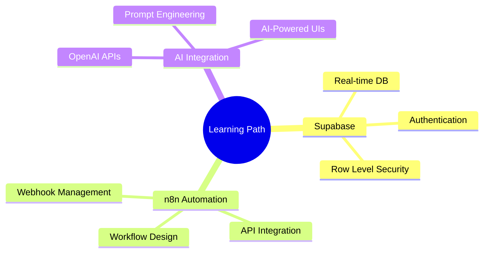

<div align="center">
  
</div>

<div align="center">
  
  [](https://santhoshhh25.github.io)
  [](https://linkedin.com/in/YOUR-LINK)
  [](https://twitter.com/YOUR-HANDLE)
  [](mailto:youremail@example.com)
  
  
  
</div>

---

## 🚀 About Me

```javascript
const santhosh = {
    pronouns: "He/Him",
    location: "India 🇮🇳",
    currentRole: "Frontend Developer",
    passions: ["Web Development", "Automation", "AI Integration"],
    askMeAbout: ["React", "JavaScript", "n8n", "Supabase", "UI/UX"],
    funFact: "I turn coffee ☕ into code 💻"
};
```

<div align="center">
  
</div>

---

## 🛠️ Tech Arsenal

### Frontend Mastery
<div align="center">
  


</div>

### Backend & Database
<div align="center">
  


</div>

### Automation & AI
<div align="center">
  


</div>

### Tools & Platforms
<div align="center">
  


</div>

---

## 🎯 Featured Projects

<div align="center">
  
| 🌟 Project | 📝 Description | 🔧 Tech Stack | 🚀 Live Demo |
|------------|----------------|---------------|--------------|
| **🦸 Marvel Universe App** | Interactive Marvel heroes & comics explorer with dynamic search | React, API Integration, CSS3 | [](https://santhoshhh25.github.io/marvel-universe/) |
| **✨ Aurora Dashboard** | Modern admin dashboard with beautiful UI/UX | React, Chart.js, Tailwind | [](https://santhoshhh25.github.io/Aurora-Dashboard/) |
| **📊 Progress Pal** | Goal tracking app with visual progress indicators | JavaScript, Local Storage, CSS | [](https://santhoshhh25.github.io/progress_pal/) |
| **🎨 Coolest New Tab** | Minimalist, customizable browser new tab page | Vanilla JS, CSS Grid, APIs | [](https://santhoshhh25.github.io/coolest-new-tab-page/) |

</div>

---

## 📊 GitHub Analytics

<div align="center">
  
  
</div>

<div align="center">
  
</div>

<div align="center">
  
</div>

---

## 🎯 Current Focus

<div align="center">
  


</div>

### 🔥 What I'm Building
- 🤖 **AI-Powered Web Apps** - Integrating ChatGPT & other AI services
- ⚡ **Automated Workflows** - Creating smart n8n automation pipelines  
- 🔐 **Full-Stack Apps** - Building with Supabase backend
- 🎨 **Creative UIs** - Pushing the boundaries of web design

---

## 🤝 Let's Connect & Collaborate

<div align="center">
  
  **Open to opportunities in:**
  
  🎯 Frontend Development • 🤖 AI Integration • ⚡ Automation Engineering
  
  **Available for:**
  
  💼 Freelance Projects • 🤝 Open Source Collaboration • 🎓 Mentoring
  
</div>

---

<div align="center">
  
  ### 💫 "Building the future, one commit at a time"
  
  
  
  **⭐ Star my repos if you find them interesting!**
  
</div>
