<div align="center">
  
</div>

<div align="center">
  
</div>

<br>

<div align="center">
  
  [](https://santhoshhh25.github.io)
  [](https://linkedin.com/in/YOUR-LINK)
  [](https://twitter.com/YOUR-HANDLE)
  [](mailto:youremail@example.com)
  
</div>

<br>

---

<div align="center">

## ⚡ **SYSTEM PROFILE**

</div>

```yaml
User: Santhosh Reddy
Role: Frontend Architect & AI Engineer
Location: India 🇮🇳
Status: Building the Future
Focus: [Web3, AI Integration, Automation]
Code_Style: Clean, Scalable, Innovative
Philosophy: "Simplicity is the ultimate sophistication"
```

<br>

---

<div align="center">

## 🛠️ **TECH ECOSYSTEM**

</div>

<div align="center">

### **Frontend Architecture**


### **Backend & Database**


### **DevOps & Tools**


### **AI & Automation**


</div>

<br>

---

<div align="center">

## 🚀 **PROJECT SHOWCASE**

</div>

<table align="center">
<tr>
<td width="50%">

<h3 align="center">🦸‍♂️ Marvel Universe</h3>
<div align="center">  
<a href="https://santhoshhh25.github.io/marvel-universe/">

</a>
<br><br>
<p><strong>Interactive Marvel Heroes Explorer</strong></p>
<p>🔧 React • API Integration • Responsive Design</p>
</div>

</td>
<td width="50%">

<h3 align="center">✨ Aurora Dashboard</h3>
<div align="center">
<a href="https://santhoshhh25.github.io/Aurora-Dashboard/">

</a>
<br><br>
<p><strong>Modern Admin Interface</strong></p>
<p>🔧 React • Chart.js • Premium UI/UX</p>
</div>

</td>
</tr>
<tr>
<td width="50%">

<h3 align="center">📊 Progress Pal</h3>
<div align="center">
<a href="https://santhoshhh25.github.io/progress_pal/">

</a>
<br><br>
<p><strong>Goal Tracking System</strong></p>
<p>🔧 JavaScript • Local Storage • Data Viz</p>
</div>

</td>
<td width="50%">

<h3 align="center">🎨 Coolest New Tab</h3>
<div align="center">
<a href="https://santhoshhh25.github.io/coolest-new-tab-page/">

</a>
<br><br>
<p><strong>Browser Extension UI</strong></p>
<p>🔧 Vanilla JS • CSS Grid • Minimal Design</p>
</div>

</td>
</tr>
</table>

<br>

---

<div align="center">

## 📊 **PERFORMANCE METRICS**

</div>

<div align="center">


</div>

<br>

<div align="center">

</div>

<br>

---

<div align="center">

## 🎯 **CURRENT MISSION**

```mermaid
graph TD
    A[🎯 Current Focus] --> B[🤖 AI Integration]
    A --> C[⚡ Automation]
    A --> D[🌐 Web3]
    
    B --> B1[OpenAI APIs]
    B --> B2[Machine Learning]
    B --> B3[AI-Powered UIs]
    
    C --> C1[n8n Workflows]
    C --> C2[Process Automation]
    C --> C3[API Integration]
    
    D --> D1[Blockchain Apps]
    D --> D2[Smart Contracts]
    D --> D3[DeFi Interfaces]
    
    style A fill:#6C5CE7
    style B fill:#A29BFE
    style C fill:#A29BFE
    style D fill:#A29BFE
```

</div>

<div align="center">



</div>

<br>

---

<div align="center">

## 🤝 **COLLABORATION**

</div>

<div align="center">

**🎯 EXPERTISE IN**
```
Frontend Architecture  •  AI Integration  •  Process Automation
```

**🚀 AVAILABLE FOR**
```
Freelance Projects  •  Open Source  •  Technical Consulting
```

**💡 INTERESTS**
```
Web3 Development  •  Machine Learning  •  Design Systems
```

</div>

<br>

---

<div align="center">
  
</div>

<div align="center">

### **⚡ "Code is poetry written in logic"**


**❤️ Thanks for visiting!**

</div>
